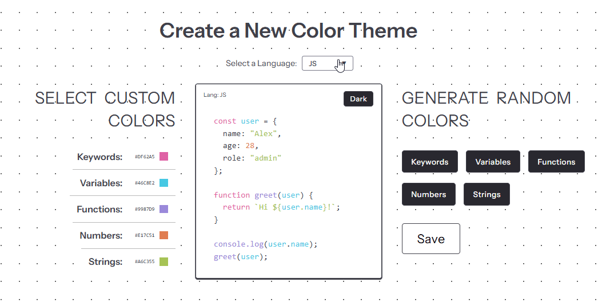
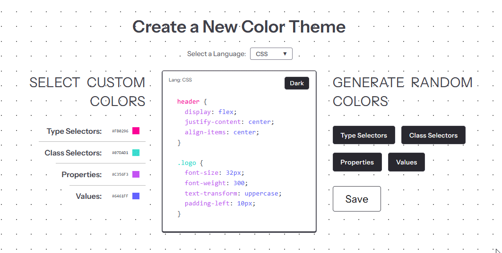
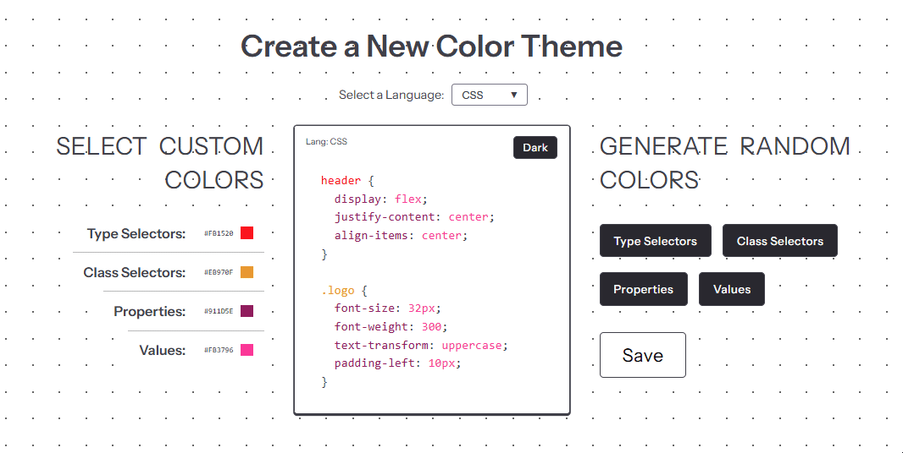

# 🎨 Custom Coding Color Theme

A React + Vite app that lets you design your own syntax color themes for HTML, CSS, and JavaScript.  
Preview your custom color settings live and instantly generate matching VS Code token color rules.

🔗 **Live Demo:** [vikspan.github.io/custom-coding-color-theme](https://vikspan.github.io/custom-coding-color-theme)  
💻 **Repo:** [github.com/vikspan/custom-coding-color-theme](https://github.com/vikspan/custom-coding-color-theme)

## ✨ Features

- 🎨 Live preview of syntax highlighting for HTML, CSS, and JS  
- ⚙️ Custom color controls with instant visual feedback  
- 🌗 Optional light/dark preview modes  
- 📋 One-click generation of VS Code–compatible color rules  
- 🚀 Built with React + Vite for fast, modern development  

## 🧩 Demo Previews

- Language Switching

<p>
  
</p>

- Color Customization

<p>
  
</p>

- Export Color Rules

<p>
  
</p>

## 🧠 How It Works

1. Choose a language (CSS, HTML, or JS).  
2. Adjust colors for selectors, properties, or keywords.  
3. Watch syntax colors update in real time.  
4. Save your theme and copy ready-to-use VS Code rules.  

## ⚙️ Getting Started

Clone the repo:

```bash
git clone https://github.com/vikspan/custom-coding-color-theme.git
cd custom-coding-color-theme
```

Install dependencies:

```bash
npm install
```

Start development server:

```bash
npm run dev
```

## 📦 Deployment

To build for production:

```bash
npm run build
```

To deploy to GitHub Pages:

```bash
npm run deploy
```

## 🛠️ Tech Stack

Vite, React, Sass, JavaScript, CSS, HTML, Git

<p align="left">
  
</p>

---

Made with 💛 by **Viktorija Špan**